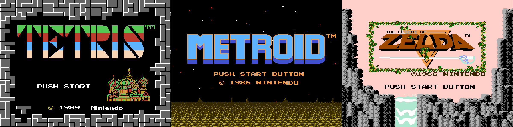

# NES Core

[](https://github.com/nnarain/nes/actions)
[](https://codecov.io/gh/nnarain/nescore)
[](https://crates.io/crates/nescore)

NES emulator and tools



Build
-----

```
cargo build
```

Several ROM tests such as `nestest`, `nes_instr_test` and `sprite_zero_hit` are run as integration tests. They can be run with the following:

```bash
# Pull in test ROMs first
git submodule update --init --recursive
# Run all tests
cargo test
```

nescore
-------

Core library for emulating the NES.

The basics so far:

```rust
use nescore::{Nes, Cartridge, Button};

fn main() {
    let mut nes: Nes = Cartridge::from_path("/path/to/rom").unwrap().into();

    // Run the NES for a single frame and return video/audio buffers.
    let (framebuffer, samplebuffer) = nes.emulate_frame();

    // Update display and audio on platform of your choice.
    // ...

    // Standard controller input: Press the 'A' button
    nes.input(Button::A, true);
}
```

Check out `nescli` for a full SDL example.

Note: The interface around streaming audio from the emulator is not fantastic at the moment, so audio will sound a bit choppy.

nescli
------

Some tooling for interacting with ROM files.

```bash
nescli run    <ROM> # Run the ROM file
nescli run -d <ROM> # Run the ROM file with CPU debug output

nescli info <ROM>   # Display cartridge header information
nescli img  <ROM>   # Dump CHR ROM to a PNG file

nescli audio <ROM>  # Just play ROM audio
```
